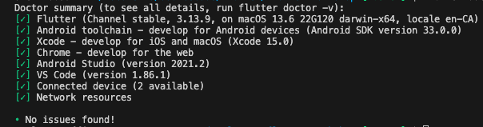

# flutter_workshop

A Flutter project meant as a entry point and introduction to Flutter development. Some of the main topics covered in this series include:

- Developing a flutter application through [CLEAN architecture](https://www.freecodecamp.org/news/a-quick-introduction-to-clean-architecture-990c014448d2/) design principal.
- Developing an app with persisted storage
- Implementing app wide navigation (Top and Bottom placements)
- Implementing Form submission and validation
- Using [Riverpod](https://riverpod.dev/) framework for state management, caching and data fetching.
- Using [Hive](https://docs.hivedb.dev/#/) for persisted data storage.
- Implementing API calls with [weatherapi](https://www.weatherapi.com/) to retrieve remote weather data.
- Implementing unit tests for various app functions.

Flutter can be developed on a variety of different systems, but this workshop will be targeting mobile development; specifically `iOS` and `Android` development.

## Prerequisites

To follow the workshop sessions, the following prerequisites are required to run Flutter.

### Install VSCode

Make sure the latest release of [VSCode](https://code.visualstudio.com/download) is installed on your machine.

### Install Flutter

Flutter is an SDK that is downloaded and installed on the host machine. The installation process highly depends on the host operation system. Flutter can be installed on `Windows`, `macOS`, `Linux`, and `ChromeOS`.

**NOTE**: Be aware that for any `iOS` simulations, installing and developing on `macOS` is required. For any other OS, `Android` is fully supported as long as [Android Studio](https://developer.android.com/studio) can be installed on the host OS.

To install and configure Flutter for your operation system, please refer to the [Flutter installation guide](https://docs.flutter.dev/get-started/install).

### Configuring iOS Development

For Flutter to run on iOS, ensure you have:

- the latest version of [XCode](https://developer.apple.com/xcode/) (for your `macOS` version)
- the latest version of [CocoaPods](https://guides.cocoapods.org/using/getting-started.html#installation)

Follow the official Flutter [iOS configuration guide](https://docs.flutter.dev/get-started/install/macos/desktop#configure-ios-development) to run the Flutter app on iOS.

### Configuring Android Development

For Flutter to run on Android, ensure that you have:

- the latest version of [Android Studio](https://developer.android.com/studio)

Follow the official Flutter [Android configuration guide](https://docs.flutter.dev/get-started/install/macos/mobile-android#configure-android-development) to run the Flutter app on Android.

The guide above will also walk you through setting up a virtual device on your host OS. For more information on setting up a Android virtual device, please refer to the [official guide](https://developer.android.com/studio/run/managing-avds) from the Android development docs.

### Check installation

Each of the guides above will show how to validate the installation of Flutter on the host machine. This is done with the `flutter doctor` command. It's best to ensure that your output from `flutter doctor` shows no errors or warnings like below before starting development.

## Session #1 Instructions
We will be creating a Trips App that allows the user to add their upcoming trips and display them in a list.
0. Create an empty project using cmd + shift + p and then type `Flutter: New Project`, enter project name as `Travel App`. Wait for the project creation to be finished.
1. Erase the code in `main.dart` as we'll be re-writing the code. If you run the app you should see empty screen.
2. Define some constants. We'll have 2 pages for our app: `My Trips` page and `Add Trips` page. We can define them as an enum `TripPage` in constants.dart.
3. Create two blank widgets that we will use for the two pages, feel free to just copy from `main.dart` for now.
4. The `build()` method can be called many times during the app's run, so it's not good to keep track of stateful information here. In order to safely keep track of information such as which page we're on, we need to change our main screen to a stateful widget.
5. Define our state: we need to keep track of the `currentPage`. And while we're here, we can also define our pages and bottom navigations, since they are constants, keeping them in the state object ensures we're only creating them once. We can also define the page controller that will be used by the widget to switch between pages, this can also live in the state object since we only need to create it once.
6. We need to change our state (`currentPage`) whenever the page controller detects a change. In `initState()`, add listener to the page controller to `setState()` when page changes. `setState()` changes the state and forces a rebuild, which changes the view base on the new state.
7. `build()` the main screen widget by adding `AppBar` with the page title, `PageView` with the pages, and `BottomNavigationBar` using the state object we defined.
8. Add onTap callback to the `BottomNavigationBar` widget to handle `setState()` with page changes when user taps the bottom nav tabs

## Getting Started

Once all Prerequisite steps have been completed and `flutter doctor` shows `No issues found!` everything should be set up to run the app on a simulator of choice (iOS or Android).

This work shop will demonstrate the development workflow using `VSCode`, but note that Flutter does offer [command-line tools](https://docs.flutter.dev/reference/flutter-cli) for a more manual approach.

1. Open the `lib/main.dart` file in `VSCode`
2. Open the `iOS Simulator` or `Android Virtual Device` (depending on which desired).
3. Navigate to `Run` > `Run Without Debugging` to start the app without debugging.

From here the app should install, load and retroactively refresh on the running device.
